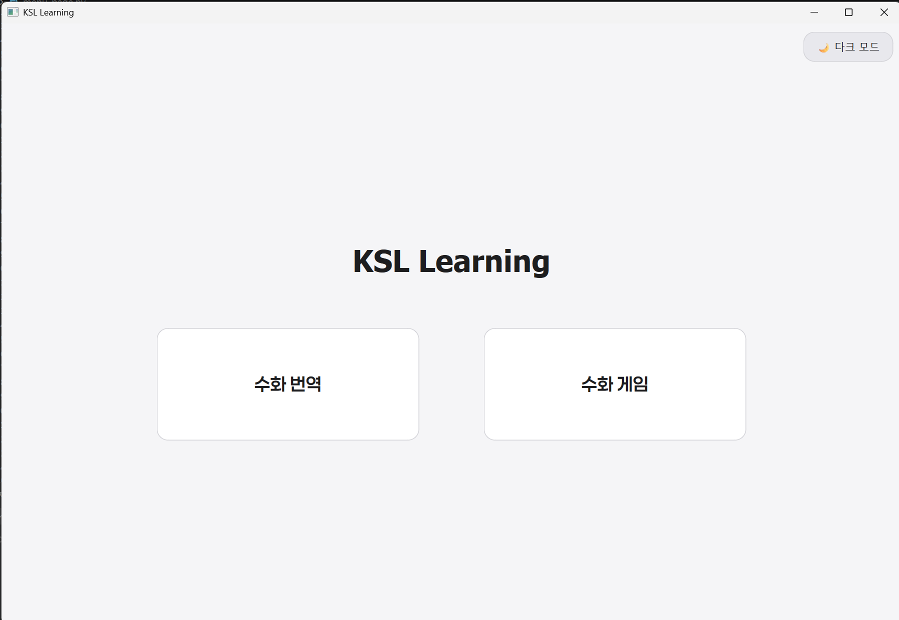
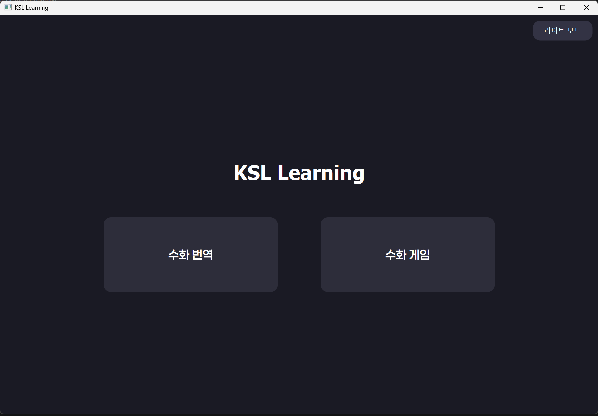
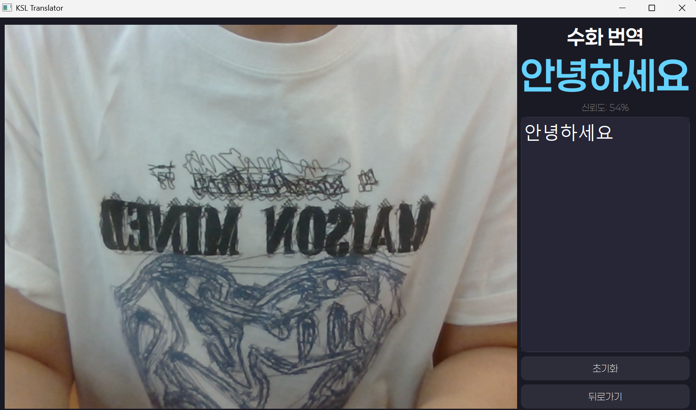
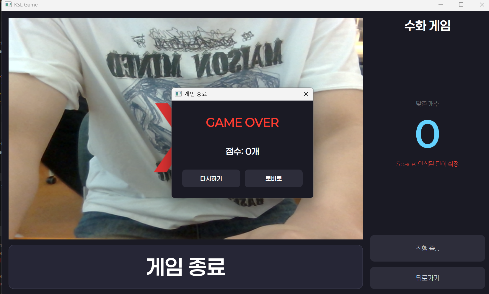

# 🤟 Real-Time Sign Language Translator & Game Application

> **AIHUB 수화 데이터 및 자체 구축 데이터셋(`dataset_custom`) 기반의 실시간 수화 인식 번역기 및 교육용 게임 소프트웨어**
> 본 프로젝트는 AIHUB 공공 수화 데이터셋과 웹캠을 통해 직접 촬영·정제한 고품질의 자체 데이터셋(`dataset_custom`)을 결합한 하이브리드 데이터 파이프라인을 구축하였습니다. 이를 바탕으로 학습된 LSTM 시계열 딥러닝 모델과 PyQt6 기반의 고도화된 GUI 인터페이스를 연동한 실시간 통합 애플리케이션입니다.

---

## 주요 기능 (Key Features)

* **하이브리드 데이터셋 기반 실시간 수화 분류 (23 Class)**
  * AIHUB 데이터의 범용성과 자체 수집 데이터(`dataset_custom`)의 특수성을 결합하여 '눈(Snow)'을 포함한 총 23가지 주요 수화 형태소 정밀 인식
* **MediaPipe 파이프라인 최적화**
  * 손가락 마디마디의 랜드마크를 실시간 3차원 좌표 데이터(Keypoints)로 변환 및 트래킹
* **PyQt6 컴포넌트 기반의 모던 UI/UX**
  * 시스템 자원 소모를 최소화한 안정적인 가로폭 고정 레이아웃 디자인
  * 사용자 편의를 위한 인앱 **다크 모드(Dark Mode) 및 라이트 모드(Light Mode)** 실시간 테마 스위칭 지원
* **수화 학습 게임 모드**
  * 실시간 점수(Score) 카운팅 시스템 및 다이나믹 UI 갱신 메커니즘 탑재

---

## 환경설정 (Settings)

| 구분 | 기술 기술 및 라이브러리 (정밀 매칭 버전) |
| :--- | :--- |
| **Language** | Python 3.10.11 |
| **Computer Vision** | OpenCV (`opencv-contrib-python 4.11.0.86`), MediaPipe (`0.10.9`) |
| **Deep Learning** | TensorFlow (`2.15.0`), NumPy (`1.24.3`), Scikit-Learn (`1.4.2`) |
| **GUI Framework** | PyQt6 (`6.11.0`), PyQt6-Qt6 (`6.11.1`), PyQt6_sip (`13.11.1`) |
| **Data Processing** | SciPy, Pandas, Matplotlib, Seaborn |

---

## 시스템 아키텍처 및 데이터 흐름 (System Architecture)
**[1. Hybrid Data Pipeline]**
* AIHUB 수화 공공 Data ──────┐
├──> Keypoint Extraction ──> 정규화 및 .npy 시퀀스 통합 빌드
dataset_custom (자체 구축) ─┘      (X, Y, Z Coordinates)

**[2. Inference Pipeline]**
* 실시간 웹캠 프레임 ──> OpenCV ──> MediaPipe (Hand Landmark) ──> 30 Frame LSTM Buffer
│
PyQt6 Main GUI Display  <──  Morpheme Prediction (23 Classes)  <───────┘

### 데이터셋 구성 및 모델 아키텍처
* **데이터 셋 (Hybrid Dataset)**: 대규모 공공 데이터(AIHUB)로 기반 뼈대를 학습시키고, 인식률이 떨어지는 특정 동적 제스처(예: '눈' 수화 동작의 손가락 까딱임 등) 및 실제 웹캠 환경의 변수를 보완하기 위해 **`dataset_custom`을 직접 촬영 및 라벨링하여 병합**했습니다.
* **Input Layer**: `(None, Frame_Length, Keypoint_Dimension)` 시계열 데이터 입력
* **LSTM Layers**: 손가락의 미세한 움직임 및 위치 변화의 맥락을 파악하기 위한 다층 순환 신경망 구조 구성
* **Dense & Softmax Layer**: 23개 형태소에 대한 확률 플래팅 및 Stratified 층화 추출 방식을 채택한 검증 모델 

---

## 애플리케이션 스크린샷 (Application UI)

| 메인 메뉴 화이트 모드 (Main menu - White) | 메인 메뉴 다크 모드 (Main menu - Dark) |
| :---: | :---: |
|  |  |
---
| 수화 번역 창 (Translator)| 수화 게임 창 (Game) |
| :---: | :---: |
|  |  |

---
*
├── .venv                     # 패키지 버전 간 충돌이 격리된 청정 가상환경
│
├── data_aihub/               # [Pipeline] AIHUB 대규모 데이터 전처리 및 학습
│   ├── convert_data_aihub.py # AIHUB 원본 데이터(벡터)를 모델 학습용 시퀀스로 변환
│   └── train_lstm_aihub.py   # AIHUB 데이터셋 기반 LSTM Baseline 모델 학습
│
├── data_mine/                # [Pipeline] 자체 수집 데이터 전처리 및 학습
│   ├── convert_data_mine.py  # 텍스트 입력 후 웹캠을 연동하여 자체 랜드마크 정보 추출 및 변환
│   └── train_lstm_mine.py    # 자체 구축 데이터셋 기반 LSTM 모델 파인튜닝 및 검증
│
├── dataset_word/             # AIHUB에서 다운로드하여 구축한 원본 단어 데이터셋
├── dataset_custom/           # 부족한 인식률 보완을 위해 직접 촬영·구축한 사용자 정의 데이터셋
│
├── fonts/                    # 애플리케이션 UI 디자인 일관성을 위한 전용 서체 자원
│   ├── GmarketSansBold.ttf   # 타이틀 및 강조용 고딕 서체 (Bold)
│   ├── GmarketSansLight.ttf  # 본문 및 부연설명용 서체 (Light)
│   ├── GmarketSansMedium.ttf # 서브 타이틀 및 버튼용 서체 (Medium)
│   └── Paperlogy/            # 메인 테마 글꼴 (Paperlogy 1단계부터 9단계 두께별 아셋 보유)
│
├── ui/                       # [View] PyQt6 기반 GUI 레이어 컴포넌트 폴더
│   ├── menu_page.py          # 애플리케이션 메인 대시보드 메뉴 및 인앱 테마 관리
│   ├── game_page.py          # 퀴즈 및 수화 학습 게임 컨텐츠 화면 (크기 고정 레이아웃 적용)
│   └── translator_page.py    # 웹캠 인터페이스 연동 실시간 수화 인벤토리 및 번역 화면
│
├── label_encoder.pkl         # 23개 수화 단어 클래스 문자열과 정수 ID 간 매핑 역직렬화 파일
├── model_lstm.keras          # 실시간 추론(Inference)에 최적화된 최종 학습 완료 LSTM 모델 가중치
├── main.py                   # Application Bootstrap (전체 프로그램 진입점)
└── README.md                 # 프로젝트 가이드 및 기술 문서

# 시작하기 (Installation & SETUP)
**1. 전용 가상환경 생성 및 활성화 (Make a virtual environment)**
```console
py -3.10 -m venv .venv
.venv\Scripts\Activate
```

**2. 패키지 및 라이브러리 설치 (Install libraries & packages)**
```console
python -m pip install --upgrade pip
pip install numpy==1.26.4 tensorflow==2.15.0 mediapipe==0.10.9 opencv-contrib-python==4.11.0.86
pip install PyQt6==6.11.0 PyQt6-Qt6==6.11.1 PyQt6_sip==13.11.1
pip install scikit-learn==1.4.2 scipy==1.15.3 pandas==2.3.3 matplotlib==3.10.9 seaborn==0.13.2 sounddevice==0.5.5 pyttsx3==2.99 pillow==12.2.0
```

**3. 애플리케이션 실행 (Applicaiton)**
```console
python main.py
```

## 한계점 (Limitation)
**1. 수화 인식 더딤 & 오류**
* 수화 인식이 더디고 오류가 날 때가 굉장히 다분했습니다. 특히 시퀀스가 많아지면 많아질수록 Accuracy가 떨어지는 것을 보고 아마 Overfit 현상이 아닐까 싶어 처음부터 단어들을 모두 시퀀스를 다시 3개로 지정하여 찍었는데도 만족스러운 결과는 아니었습니다.

**2. 게임**
* 게임의 데이터베이스를 연결하여 리더보드까지 구현하고 싶었지만 정작 모델을 학습시킬 데이터 쌓을 시간 마저도 부족하여 하지 못 해 아쉽습니다.
